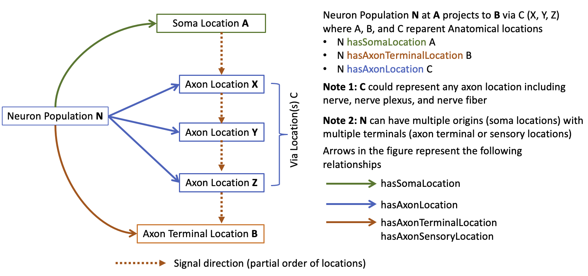

# SCKAN Query Examples

* [Query examples in Jupyter Notebook](https://github.com/smtifahim/sckan-query-examples/blob/main/sckan-sparql-query-examples.ipynb)

# About SCKAN Connectivity Knowledge Base

A core component of SPARC is the SPARC Connectivity Knowledgebase of the Autonomic Nervous System (SCKAN).

* SCKAN contains knowledge about CNS-ANS-end organ connectivity
  * Derived from credible sources
    * Interviews with SPARC investigators, Anatomical experts (SAWG)
    * Textbooks, SPARC data, and Scientific literature (using NLP and then curated)
* SCKAN is represented in a form that supports automated reasoning
  * Connections are annotated with SPARC vocabularies - a set of SPARC anatomical terms mapped
    to the community ontologies like UBERON

## How are Neuronal Connectivites Modelled in SCKAN?

The neuronal connectivities in SCKAN are modelled at the ‘Neuron Population’ level. A neuron population refers to a set of neuron types with shared defining properties e.g., phenotypes. For example, populations that have their somas located in the SCG can be differentiated by considering their projection targets.

* SCKAN can model connectivity of a single neuron population based on locational phenotypes, largely in the following form:

  * **"Neurons with somas in structure A project to structure B via structure C."**
* SCKAN  supports modelling the locations of the somas, dendrites, axon segments, and synapses for its neuron populations

  * SCKAN also supports modelling of the partial orders of the axonal paths between the origin
    and the destination of the neuron populations

The following diagram depicts how Neuron populations are modelled in SCKAN. 

## The Phenotypic Relations in SCKAN

To write the SPARQL queries we simply need to know about the following relational predicates used in SCKAN as listed in the tables below.

### Locational Phenotypes in SCKAN

| Phenotypic Relation                  | Description                                                                                                                                                |
| ------------------------------------ | :--------------------------------------------------------------------------------------------------------------------------------------------------------- |
| **1. hasSomaLocation**         | Expresses a relation between a neuron population and its origin i.e., location of the cell body                                                            |
| **2. hasAxonLocation**         | Expresses a relation between a neuron population and its axon location                                                                                    |
| **3. hasDendriteLocation**     | Expresses a relation between a neuron population and its dendrite location                                                                                |
| **4. hasAxonTerminalLocation** | Expresses a relation between a neuron population and its axon terminal location (i.e., the location of the axon presynaptic element)                  |
| **5. hasAxonSensoryLocation**  | Expresses a relation between a neuron population and its sensory axon terminal location (i.e., the location of the axon sensory subcellular element) |

### **Other Phenotypes in SCKAN**

| Phenotypic Relation                | Description                                                                                                                                                                                                                                                                                                                           |
| ---------------------------------- | ------------------------------------------------------------------------------------------------------------------------------------------------------------------------------------------------------------------------------------------------------------------------------------------------------------------------------------- |
| **hasNeuronalPhenotype**     | Expresses a relation between a neuron population and its ANS phenotype - **Pre-Ganglionic or Post-Ganglionic**, **Sympathetic** or **Parasympathetic** - Combinations like  **Sympathetic  Pre-Ganglionic** or **Parasympathetic Post-Ganglionic**                                         |
| **hasFunctionalCircuitRole** | Expresses a relation between a neuron population and its immediate effect on postsynaptic cells - **Excitatory** or **Inhibitory**                                                                                                                                                                                |
| **hasCircuitRole**           | Expresses a relation between a neuron population and its circuit role phenotype - Possible phenotypes are: **Intrinsic**, **Motor**, **Sensory**, or **Projection**                                                                                                                                    |
| **hasProjection**            | Expresses a relation between a neuron population and a brain region where the neuron population sends axons towards - **Spinal cord descending projection**, **Spinal cord ascending projection** - **Intestino fugal projection**, **Anterior projecting**, **Posterior projecting** |
| **isObservedInSpecies**      | Expresses a relationship between a neuron type and a taxon. Used when a neuron population has been observed in a specific species. - **Species from NCBI Taxonomy**                                                                                                                                                   |
| **hasPhenotypicSex**         | Expresses a relationship between a neuron type and a biological sex. Used when a neuron population has been observed in a specific sex. - **Male or **Female** from PATO**                                                                                                                                     |
| **hasForwardConnection**     | Expresses a relationship to specify the synaptic forward connection from a pre-ganglionic neuron population to a post-ganglionic neuron population.                                                                                                                                                                             |

##### Explore the [Query examples in Jupyter Notebook](https://github.com/smtifahim/sckan-query-examples/blob/main/sckan-sparql-query-examples.ipynb)
