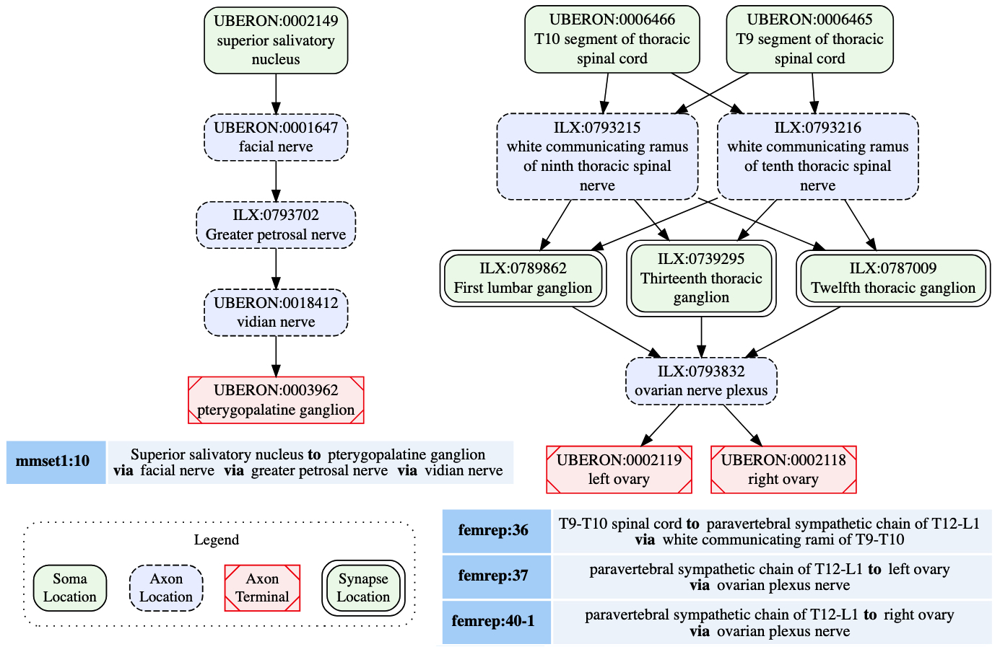

# Exploring SCKAN Using Example Queries

This document provides the basic background knowledge necessary to explore SCKAN using SPARQL. It also includes a set of competency quries (CQs) to demonstrate how SCKAN can be used to ask questions relevant to ANS connectivity.

### Jump to the [Query Examples in Jupyter Notebook](example-queries/sckan-sparql-query-examples.ipynb)

## **Table of Contents**

- [Introduction](#introduction)
- [Background](#background)
  * [How SCKAN Models its Connectivity](#how-sckan-models-its-connectivity)
  * [SCKAN Connectivity Examples](#sckan-connectivity-examples)
  * [Phenotypic Relations in SCKAN](#phenotypic-relations-in-sckan)
    + [Locational Phenotypes in SCKAN](#locational-phenotypes-in-sckan)
    + [Other Phenotypes in SCKAN](#other-phenotypes-in-sckan)
- [SCKAN Competency Queries](#sckan-competency-queries)
  - [How to Run the Competency Queries](#how-to-run-the-competency-queries)
  - [CQ-1: What connections terminate in the bladder? What are the origins of those connections and what are the exact parts of the organ the connections 	terminate. What nerves are involved in those connections?](#cq-1-what-connections-terminate-in-the-bladder--what-are-the-origins-of-those-connections-and-what-are-the-exact-parts-of-the-organ-the-connections-terminate-what-nerves-are-involved-in-those-connections-?)
    * [Raw Query Result for CQ-1](#raw-query-result-for-cq-1)
    * [Visual Query Result for CQ-1](#visual-query-result-for-cq-1)
  - [CQ-2: What are all origins and destinations of neuron populations traveling through the vagus?](#cq-2--what-are-all-origins-and-destinations-of-neuron-populations-traveling-through-the-vagus-)
    * [Raw Query Result for CQ-2](#raw-query-result-for-cq-2)
    * [Visual Query Result for CQ-2](#visual-query-result-for-cq-2)
  - [CQ-3: What anatomical structures might be affected by perturbation of the inferior mesenteric ganglion?](#cq-3--what-anatomical-structures-might-be-affected-by-perturbation-of-the-inferior-mesenteric-ganglion-)
    * [Raw Query Result for CQ-3](#raw-query-result-for-cq-3)
    * [Visual Query Result for CQ-3](#visual-query-result-for-cq-3)
  - [CQ4: How is sympathetic innervation supplied to the ovaries? Show the origins, terminations, and routing for both pre- and post-ganglionic connections.](#cq4--how-is-sympathetic-innervation-supplied-to-the-ovaries--show-the-origins--terminations--and-routing-for-both-pre--and-post-ganglionic-connections)
    * [Raw Query Result for CQ-4](#raw-query-result-for-cq-4)
    * [Visual Query Result for CQ-4](#visual-query-result-for-cq-4)
- [Additional Query Examples](#additional-query-examples)

# Introduction

The NIH Common Fund's Stimulating Peripheral Activity to Relieve Conditions ([SPARC](https://commonfund.nih.gov/sparc)) initiative is a large-scale program designed to advance the development of precise and effective bioelectronic neuromodulation therapies for various diseases and conditions. A key component of the SPARC project, the SPARC Connectivity Knowledgebase of the Autonomic Nervous System (SCKAN, [RRID:SCR_026088](https://scicrunch.org/resolver/RRID:SCR_026088)), is a dynamic knowledge base of ANS connectivity that contains information about the origins, terminations, and routing of ANS projections between the central nervous system and end organs. The distillation of SPARC's connectivity knowledge into SCKAN involves a rigorous curation process to capture connectivity information provided by experts, published literature, textbooks, and SPARC scientific data. SCKAN is being used within SPARC to generate interactive connectivity maps available via the [SPARC Portal](https://sparc.science/apps/maps?id=7d8ad680).


> **Figure 0:** A high-level depiction of SCKAN’s knowledge construction flow, starting with the extraction and distillation of connectivity knowledge from different sources, followed by the curation and transformation of this knowledge into formal representations, and finally, making the knowledgebase available via different graph database endpoints.

**Figure 0** provides a high-level depiction of SCKAN’s knowledge construction flow. To know more about SCKAN and the details of its knowledge construction flow depicted in the figure, refer to the following article.

* Imam FT, Gillespie TH, Ziogas I, Surles-Zeigler MC, Tappan S, Ozyurt BI, Boline J, de Bono B, Grethe JS, Martone ME (2024). [Developing a Multiscale Neural Connectivity Knowledgebase of the Autonomic Nervous System](https://www.biorxiv.org/content/10.1101/2024.10.25.620360v3). bioRxiv 2024.10.25.620360. **doi:** https://doi.org/10.1101/2024.10.25.620360

In this document, we provide the background knowledge needed to write SPARQL queries to explore SCKAN. We also include a set of competency quries (CQs) to demonstrate how SCKAN can be used to ask questions relevant to ANS connectivity.

# Background

## How SCKAN Models its Connectivity

SCKAN models connectivity at the neuronal level, where connections are represented based on the locations of neuronal cell bodies, axon segments, dendrites, and axon terminals. Each connection represents a population of PNS neurons with a given PNS phenotype (e.g. sympathetic pre-ganglionic) that projects to a given set of targets, where the exact cell type identity may not be known. A neuron population in SCKAN refers to a set of neurons with shared phenotypic properties without specifying the neron types. The connectivity of a neuron population is modeled based on its locational phenotypes using the following form:

* **Neuron population $N$ at $A$ projects to $B$ via $C$**, where
  * $A$ represents a set of anatomical regions containing the somata;
  * $B$ represents a set of anatomical regions containing the axon terminals; and
  * $C$ denotes the set of distinct anatomical region(s) between $A$ and $B$ that contain the axon segments, including nerves.

SCKAN also supports modelling of the partial orders of the axonal paths between the origin and the destination of the neuron populations. The following diagram in **Figure 1** depicts the connectivity model of a generic neuron population in SCKAN.


> **Figure 1:** SCKAN's connectivity model of a neuron population based on its axonal projection path.

In addition to specifying the anatomical locations of neuronal segments, each neuron population in SCKAN can be further specified with other relevant phenotypic properties, e.g.:

* **ANS Subdivision**: Sympathetic or Parasympathetic, Preganglinic or Post-ganglionic
* **Circuit Role**: Intrinsic, Motor, Sensory, or Projection
* **Functional Circuit Role**: Whether the connection is Excitatory or Inhibitory
* **Species and Sex**: The specificity of Species and Sex the connection was observed in

A given population subserves a single PNS phenotype, e.g., sympathetic pre or post ganglionics, but may have multiple origins, primarily to indicate that a connection arises from multiple spinal cord segments, as well as multiple terminal locations. SCKAN currently does not model whether a neuron population projecting to multiple regions does so via branching axons or whether distinct subpopulations project to distinct targets. We use the axon sensory terminal to indicate the peripheral process of pseudo-monopolar dorsal root ganglia connections.

SCKAN facilitates the modeling of connectivity circuits by specifying synaptic forward connections between first-order and second-order neuron populations. Preganglionic neuron populations, originating in the CNS and terminating in ANS ganglia, represent the first-order connections in SCKAN. Postganglionic populations, originating in the ANS ganglia and terminating in a specific part of a target organ, represent the second-order connections. When a forward connection is specified between two populations, the synapse location within the circuit can be identified as the common structure(s) where the preganglionic connection terminates (the location of the axon presynaptic element) and the postganglionic connection originates.

## SCKAN Connectivity Examples

The connectivity of a single neuron population includes distinct anatomical structures along its projection paths from its origin(s) to its destination(s). The diagram on the left in **Figure 2** shows a connectivity pathway of a parasympathetic preganglionic neuron population in SCKAN, originating at the superior salivatory nucleus and terminating at the pterygopalatine ganglion. In this example, the axon reach its target via the facial nerve, followed by the greater petrosal nerve and then the vidian nerve.



> **Figure 2:** Neural connectivity examples from SCKAN. The left diagram illustrates the connectivity pathway of a parasympathetic preganglionic population, while the diagram on the right depicts a sympathetic innervation circuit of the ovary, formed by synaptic connections between pre- and postganglionic populations. Each node in the diagrams is labeled with the corresponding anatomical region, drawn from standard vocabulary sources such as UBERON or InterLex (ILX), along with its CURIE (compact URI).

The diagram on the right in **Figure 2** shows an example of a sympathetic innervation circuit of the ovary, formed by the synaptic connections between a sympathetic preganglionic population (`femrep:36`) and two postganglionic populations (`femrep:37` and `femrep:40-1`), observed in female rats. The preganglionic population (`femrep:36`) originates from two adjacent locations (T9-T10 segments of thoracic spinal cord) and terminates in three locations (T12-L1 paravertebral sympathetic chain) via the  white communicating rami of T9-10. The origins (the somata locations) of the postganglionic populations (`femrep:37` and `femrep:40-1`) are synaptically co-located with the preganglionic terminals, and their axons travel via the ovarian nerve plexus, with one terminating in the left ovary and the other in the right ovary. All the nodes representing the anatomical regions in **Figure 2** are drawn from standard vocabulary sources including UBERON ([RRID:SCR_010668](https://scicrunch.org/resolver/RRID:SCR_010668)), InterLex (ILX, [RRID:SCR_016178](https://scicrunch.org/resolver/RRID:SCR_016178)).

Refer to the [SCKAN article](https://www.biorxiv.org/content/10.1101/2024.10.25.620360v3) to know more about SCKAN along with its modeling principles, curation process, vocabualary management, and competency queries.

## Phenotypic Relations in SCKAN

To get started with writing SPARQL queries for SCKAN we simply need to know about the phenotypic relations (predicates) supported by [Simple SCKAN](https://github.com/SciCrunch/sparc-curation/blob/master/docs/simple-sckan/readme.md) as listed in the tables below. These properties are specified as OWL annotation properties in [simple-sckan-properties.ttl](https://github.com/smtifahim/Loading-Simple-SCKAN/blob/main/sckan-to-simple-sckan/input_ttl/simple-sckan-properties.ttl) file.

### Locational Phenotypes in SCKAN

| Phenotypic Relation                | Description                                                                                                                                                                                                    |
| ---------------------------------- | :------------------------------------------------------------------------------------------------------------------------------------------------------------------------------------------------------------- |
| **hasSomaLocation**          | Expresses a relation between a neuron population and its origin i.e., location of the cell body                                                                                                                |
| **hasAxonLocation**          | Expresses a relation between a neuron population and its axon location                                                                                                                                        |
| **hasDendriteLocation**      | Expresses a relation between a neuron population and its dendrite location                                                                                                                                    |
| **hasAxonTerminalLocation**  | Expresses a relation between a neuron population and its axon terminal location (i.e., the location of the axon presynaptic element)                                                                           |
| **hasAxonSensoryLocation**   | Expresses a relation between a neuron population and its sensory axon terminal location (i.e., the location of the axon sensory subcellular element)                                                          |
| **hasAxonToSensoryTerminal** | Expresses a relation between a neuron population and the anatomical structure where its axon distally projects to the axon sensory terminal (i.e., the axon sensory subcellular element).                      |
| **hasConnectedLocation**     | Expresses a relation between a neuron population and any of its connected location listed above. This property serves as the super property of the properties listed above and not used for direct assertions. |

### Other Phenotypes in SCKAN

| Phenotypic Relation                | Description                                                                                                                                                                                                                                                                                                                      |
| ---------------------------------- | :------------------------------------------------------------------------------------------------------------------------------------------------------------------------------------------------------------------------------------------------------------------------------------------------------------------------------- |
| **hasNeuronalPhenotype**     | Expresses a relation between a neuron population and its ANS phenotype<br />- **Pre-Ganglionic or Post-Ganglionic**, **Sympathetic** or **Parasympathetic**<br />- Combinations like  **Sympathetic  Pre-Ganglionic** or **Parasympathetic Post-Ganglionic**                                    |
| **hasFunctionalCircuitRole** | Expresses a relation between a neuron population and its immediate effect on postsynaptic cells<br />- **Excitatory** or **Inhibitory**                                                                                                                                                                           |
| **hasCircuitRole**           | Expresses a relation between a neuron population and its circuit role phenotype<br />- Possible phenotypes are: **Intrinsic**, **Motor**, **Sensory**, or **Projection**                                                                                                                               |
| **hasProjection**            | Expresses a relation between a neuron population and a brain region where the neuron population sends axons towards<br />- **Spinal cord descending projection**, **Spinal cord ascending projection**<br />- **Intestino fugal projection**, **Anterior projecting**, **Posterior projecting** |
| **isObservedInSpecies**      | Expresses a relationship between a neuron type and a taxon. Used when a neuron population has een observed in a specific species.<br />- **Species** from **NCBI Taxonomy**                                                                                                                                         |
| **hasPhenotypicSex**         | Expresses a relationship between a neuron type and a biological sex. Used when a neuron population has been observed in a specific sex.<br />- **Male** or **Female** from **PATO**                                                                                                                          |
| **hasForwardConnection**     | Expresses a relationship to specify the synaptic forward connection from a pre-ganglionic neuron population to a post-ganglionic neuron population.                                                                                                                                                                             |

# SCKAN Competency Queries

SCKAN was designed to answer questions relevant to ANS connectivity. To demonstrate the functionality of SCKAN we developed a set of competency queries (CQ). In this section, we work through the CQs and examine the results. For each question, we provide the SPARQL query and a visualization of the query results. All of the SPARQL queries listed in this section are written using Simple SCKAN.

* Navigate to [this directory](./competency-queries/) for the raw query results in CSV format, along with the visual diagrams produced by the SPARQL queries included in this section.
* For the first three CQs we used [RAWGraphs](https://github.com/rawgraphs/rawgraphs-app) to produce the visual query results. RawGraphs is an open-source tool to create customized vector-based visualizations on top of $d3.js$ library.
* For the fourth CQ, we developed a custom visualizer utilizing [GraphViz](https://graphviz.org/), an open-source graph visualization library to represent structural information as diagrams.

#### How to Run the Competency Queries

* You can use [Stardog Studio](https://www.stardog.com/studio/) as the SPARQL query interface for SCKAN. A Stardog endpoint is set up by the [FDI Lab](https://www.fdilab.org/) to provide access to SCKAN via Stardog Studio.
  * [Link to the documentation on how to run SCKAN queries using Stardog Studio](https://github.com/SciCrunch/sparc-curation/blob/master/docs/simple-sckan/readme.md#running-simple-sckan-queries-in-stardog)
* Alternatively, you can download the SCKAN plus the UBERON ontology files (linked below) and load them into your own graph database system that supports SPARQL and SPARQL-star queries.
  * Download the SCKAN ontology file from the following link: [npo-simple-sckan-merged.ttl](https://raw.githubusercontent.com/smtifahim/Loading-Simple-SCKAN/refs/heads/main/sckan-to-simple-sckan/generated_ttl/npo-simple-sckan-merged.ttl)
  * Download the UBERON ontology files from the following links:
    * [Link for downloading uberon.ttl](https://github.com/smtifahim/Loading-Simple-SCKAN/blob/main/sckan-to-simple-sckan/input_ttl/uberon.ttl)
    * [Link for downloading uberon-reasoned.ttl](https://github.com/smtifahim/Loading-Simple-SCKAN/blob/main/sckan-to-simple-sckan/input_ttl/uberon-reasoned.ttl)

#### CQ-1: What connections terminate in the bladder? What are the origins of those connections and what are the exact parts of the organ the connections terminate. What nerves are involved in those connections?

The SPARQL query in **Listing 1** retrieves the required information by filtering the set of neuron populations in SCKAN with specific connections to the urinary bladder. The query identifies populations with their soma located in one region (Region A), their axon terminal or axon sensory terminal located in another region (Region B), and the axon potentially passing through or being located in a third region (Region C) which must be a nerve. The focus of the query is on neuron populations where Region B must satisfy the constraint of being a part of the bladder.

```SPARQL
## CQ1: What connections terminate in bladder? What are the origins of those connections and what 
## are the exact parts of the organ the connections terminate? What nerves are involved in those connections?
## Query for CQ1: This query returns the neuron populations with their origin (soma) located in Region A, 
## axon terminal in Region B, and axon located in region C which is a nerve. Region B of the populations 
## must be a part of the bladder. 

PREFIX rdfs: <http://www.w3.org/2000/01/rdf-schema#>
PREFIX ilxtr: <http://uri.interlex.org/tgbugs/uris/readable/>

## Select distinct neuron populations and their associated regions
SELECT DISTINCT ?Neuron_ID 
?A_IRI ?A_Label ?B_IRI ?B_Label ?C_IRI ?C_Label 
?Target_Organ_IRI ?Target_Organ_Label
{  
    ## Filter to only include neuron populations connected to the urinary bladder.
    FILTER (?Target_Organ_Label = 'urinary bladder').
  
    ## Filter to only include C (Axon Location) that is a nerve, nerve plaxus or fiber. 
    FILTER (?C_Type in ('nerve', 'nerve plexus', 'nerve fiber'))

    ## Only consider neuron populations from SCKAN. 
    VALUES ?SCKAN_Neuron { ilxtr:NeuronSparcNlp ilxtr:NeuronApinatSimple }
  
    ?Neuron_ID rdfs:subClassOf+ ?SCKAN_Neuron;
               ilxtr:hasSomaLocation ?A_IRI;
               ilxtr:hasAxonLocation | ilxtr:hasAxonToSensoryTerminal ?C_IRI;   
               ilxtr:hasAxonTerminalLocation | ilxtr:hasAxonSensoryLocation ?B_IRI.
  
    ?A_IRI rdfs:label ?A_Label. ?B_IRI rdfs:label ?B_Label. ?C_IRI rdfs:label ?C_Label.
  
    ## Check if region C is a subclass* of a nerve, nerve plexus, fiber.
    ?C_IRI rdfs:subClassOf*/rdfs:label ?C_Type.
  
    ## Check if Region B is part of the target organ, either directly or transitively.
    ?B_IRI (ilxtr:isPartOf*)/rdfs:label ?Target_Organ_Label.
    ?Target_Organ_IRI rdfs:label ?Target_Organ_Label
}
ORDER BY ?Neuron_ID ?A_Label ?B_Label ?C_Label
```

> **Listing 1:** The SPARQL query for CQ1 to retrieve the connections projecting to the urinary bladder, detailing their origins (Region A), termination points within the bladder (Region B), and axon locations within associated nerves (Region C). [View the SPARQL code here](./competency-queries/CQ1-Query.rq).

##### Raw Query Result for CQ-1

* The query for all populations that terminate in the bladder returns connections contained within $6$ distinct neuron populations that have axon terminals in some part of the bladder.
* Link to the raw query results in csv format: [CQ1-Results.csv](./competency-queries/CQ1-Results.csv).

##### Visual Query Result for CQ-1

The visual query results in Figure-3 shows the origins of the connections and the nerves through which they traverse, including bladder nerve, pelvic splanchnic nerve, and hypogastric nerve.


> **Figure 3:** A visual query result for *CQ-1*, showing the neural pathways terminating in the bladder, illustrating their origins (nodes on the right), nerve involvement (nodes in the middle), and specific bladder regions targeted (nodes on the left). Nodes are color-coded to distinguish the connections based on the terminal structures in the bladder. ([View the SVG version of this diagram for better resolution](competency-queries/CQ1-Viz.svg))

#### CQ-2: What are all origins and destinations of neuron populations traveling through the vagus?

The SPARQL query in **Listing-2** retrieves the required information based on filtering a set of neuron populations in SCKAN with specific connections via the vagus nerve or its branches.

```SPARQL
# CQ2: What are all origins and destinations of neuron populations traveling through the vagus?
# Query for CQ2: This query returns any neuron population that has its origin (soma) located in 
# Region A, axon terminal or axon sensory terminal located in Region B, and axon located in nerve C, 
# where C is vagus nerve or its part.

PREFIX rdfs: <http://www.w3.org/2000/01/rdf-schema#>
PREFIX ilxtr: <http://uri.interlex.org/tgbugs/uris/readable/>

SELECT DISTINCT 
?Neuron_ID ?Neuron_Label 
?A ?Region_A ?B ?Region_B ?C ?Region_C 
{
   FILTER (LCase (?nerve_label) = 'vagus nerve')
   ?Neuron_ID rdfs:label ?Neuron_Label;
              ilxtr:hasSomaLocation ?A; 
              ilxtr:hasAxonLocation | ilxtr:hasAxonToSensoryTerminal ?C;
              ilxtr:hasAxonTerminalLocation | ilxtr:hasAxonSensoryLocation ?B.
  
    ?A rdfs:label ?Region_A. ?B rdfs:label ?Region_B. ?C rdfs:label ?Region_C.
  
    ## Check if region C is a subclass or partof of the given nerve ether directly or transitively.
    ?C (rdfs:subClassOf* | ilxtr:isPartOf*)/rdfs:label ?nerve_label.
}
ORDER BY ?Neuron_ID ?Region_B ?Region_C
```

> **Listing 2:** The SPARQL query for *CQ2* to retrieve neural connections with origins (Region A) and
> destinations (Region B) that travel through the vagus nerve or its branches (Region C). [View the SPARQL code here](./competency-queries/CQ2-Query.rq).

##### Raw Query Result for CQ-2

* The query result shows that SCKAN currently has $35$ neuron populations traveling through the vagus nerve, arising from the following $7$ distinct origins: inferior vagus X ganglion (nodose ganglion), dorsal motor nucleus of vagus nerve, nucleus ambiguus, superior cervical ganglion, left nodose ganglion, right nodose ganglion, and the nucleus of solitary tract. The query returns $43$ distinct destination structures across different organs innervated by the vagus nerve or its branches.
* The query recognizes the following partonomic vagus nerve branches from SCKAN: external and internal branches of superior laryngeal nerve, external and internal branches of inferior laryngeal nerve, superior laryngeal nerve, abdominal branch of vagus nerve, esophageal vagus trunk, vagus X nerve trunk, anterior and posterior abdominal vagal trunks, and the posterior hepatic branch of vagus nerve.
* Link to the raw query results in csv format: [CQ2-Results.csv](./competency-queries/CQ2-Results.csv).

##### Visual Query Result for CQ-2

Figure-4 shows the visual result for the vagus nerve connections in SCKAN based on *CQ-2*.


> **Figure 4:** A visual query result for *CQ-2*: The origins (the left nodes) and destinations (the nodes on the right) of neural connections via the vagus nerve or its brances (the nodes in the middle), highlighting its diverse innervation across multiple organs. ([View the SVG version of this diagram for better resolution](competency-queries/CQ2-Viz.svg))

#### CQ-3: What anatomical structures might be affected by perturbation of the inferior mesenteric ganglion?

This type of query represents one of the driving motivations for SPARC and SCKAN, the ability to better predict on and off target effects for a given electrode placement. Based on the anatomical information in SCKAN, we can pose this query by retrieving all populations that have any part (soma, axon, axon terminal) in the IMG and then retrieving their origins and destinations. The SPARQL query for CQ3 is provided in **Listing 3** below.

```SPARQL
# CQ3: What anatomical structures might be affected by perturbation of the IMG?
# Query for CQ3: This query returns the distinct set of anatomical structures connected 
# to the IMG based on a set of neuron populations in SCKAN with processes in IMG.

PREFIX rdfs: <http://www.w3.org/2000/01/rdf-schema#>
PREFIX ilxtr: <http://uri.interlex.org/tgbugs/uris/readable/>

SELECT Distinct #?Neuron_ID
?Location_ID ?Location_Label
?Connected_Region_ID ?Connected_Region 
{
    FILTER (LCase(?Location_Label) = 'inferior mesenteric ganglion').
   
    # ilxtr:hasConnectedLocation is equivalent to the implied hasAxonLocation which includes 
    # the locations of all parts of a neuron i.e., the dendrite, soma, axon, axon terminal, 
    # and axon sensory terminal.
    ?Neuron_ID ilxtr:hasConnectedLocation ?Location_ID.
    ?Location_ID rdfs:label ?Location_Label.
  
    ?Neuron_ID ilxtr:hasConnectedLocation ?Connected_Region_ID.
    ?Connected_Region_ID rdfs:label ?Connected_Region.
   
    FILTER (?Location_ID != ?Connected_Region_ID)
}
ORDER BY ?Connected_Region
```

> **Listing 3:** The SPARQL query for *CQ-3* to identify anatomical structures potentially affected by
> perturbations of the inferior mesenteric ganglion (IMG) based on neuron populations in SCKAN.

##### Raw Query Result for CQ-3

* The query result shows that SCKAN currently has 55 distinct anatomical structures that might be affected by perturbation of the IMG.
* Link to the raw query results in csv format: [CQ3-Results.csv](./competency-queries/CQ3-Results.csv).

##### Visual Query Result for CQ-3

The visual result in **Figure 5** shows the $55$ unique structures that could potentially be affected through a perturbation of the IMG based on *CQ-3*.


> **Figure 5:** A visual query result for *CQ-3* showing the 55 potential anatomical structures in SCKAN that might be affected by perturbing the inferior mesenteric ganglion. ([View the SVG version of this diagram for better resolution](competency-queries/CQ3-Viz.svg))

#### CQ-4: How is sympathetic innervation supplied to the ovaries? Show the origins, terminations, and routing for both pre- and post-ganglionic connections.

This query looks for all pre- and post-ganglionic sympathetic populations connected via a forward connection where the post- ganglionic neurons terminate in the ovary. SCKAN currently connects pre- and post- ganglionic populations through the `hasForwardConnection` property, but the property is not reciprocal. **Listing 4** provides the SPARQL query for *CQ-4*.

```SPARQL
## CQ4: How is sympathetic innervation supplied to an end organ? Show the origins, terminations 
## and routing for both pre- and post-ganglionic connections.

PREFIX rdfs: <http://www.w3.org/2000/01/rdf-schema#>
PREFIX ilxtr: <http://uri.interlex.org/tgbugs/uris/readable/>

SELECT DISTINCT ?Neuron_Connected ?V1_ID ?V1 ?V1_Type ?V2_ID ?V2 ?V2_Type ?IsSynapse
WHERE
{
    # Specify the Target_Organ
    FILTER (?Target_Organ = 'ovary')
   
    # Specify the ANS phenotype for the Target_Neuron
    FILTER (?Target_Neuron_Phenotype = 'Sympathetic Post-Ganglionic phenotype').
    ?Target_Neuron ilxtr:hasNeuronalPhenotype/rdfs:label ?Target_Neuron_Phenotype.
  
    # Get the Final_Terminal of the Target Neuron.
    ?Target_Neuron (ilxtr:hasAxonTerminalLocation | ilxtr:hasAxonSensoryLocation) ?Final_Terminal.
    # Final terminal of the Target Neuron must be a part of Target Organ.
    ?Final_Terminal (ilxtr:isPartOf* | ilxtr:suppliesTo*)/rdfs:label ?Target_Organ.
   
    # Get all neurons that are synaptically connected to the Target_Neuron
    OPTIONAL { ?Neuron_Connected ilxtr:hasForwardConnection* ?Target_Neuron. }
  
    ?V1_ID ilxtr:hasNextNode{ilxtr:isConnectedBy ?Neuron_Connected} ?V2_ID.
  
    ?V1_ID rdfs:label ?V1. ?V2_ID rdfs:label ?V2.
   
    # Find the locational phenotypes for the V1 node
    ?Neuron_Connected ?V1_Location_Type_IRI ?V1_ID. ?V1_Location_Type_IRI rdfs:label ?V1_Type.
  
    # Find the locational phenotype for the V2 node
    ?Neuron_Connected ?V2_Location_Type_IRI ?V2_ID. ?V2_Location_Type_IRI rdfs:label ?V2_Type.
  
    # Filter out the generic hasConnectedLocation relation for the connected nodes.
    FILTER (ilxtr:hasConnectedLocation not in (?V1_Location_Type_IRI, ?V2_Location_Type_IRI))
  
    # Check if ?V2_ID is associated with a synapse
    OPTIONAL 
    {
        ?Neuron_Connnected ilxtr:hasForwardConnection/ilxtr:hasSomaLocation ?Synapse.
        FILTER (?V2_ID = ?Synapse)
        FILTER (?V2_Type = "hasAxonTerminalLocation")
    }
  
    # Set IsSynapse to "Yes" if a synapse is detected, otherwise leave it as NO
    BIND (IF (BOUND(?Synapse), "YES", "NO") AS ?IsSynapse)
}
ORDER BY ?Neuron_Connected ?V1 ?V2
```

> **Listing-4:** The SPARQL code for *CQ-4* to trace sympathetic innervation pathways to the ovary, detailing origins, terminations, and routing of pre- and post-ganglionic connections, including synapse locations.

##### Raw Query Result for CQ-4

* The query result suggests that the sympathetic innervation to the ovaries involves $5$ preganglionic and $6$  postganglionic sympathetic neuron populations linked by the synaptic forward connections.
* Link to the raw query results in csv format: [CQ4-Results.csv](./competency-queries/CQ4-Results.csv).

##### Visual Query Result for CQ-4

Figure 6 shows the visualization of the result. The figure shows the origins, terminations, and routing for both pre- and post-ganglionic connections along with $5$ synaptic locations. It should be noted that the visual query result is simplified for easier comprehension by collapsing the nodes representing multiple adjacent segmental structures into single ones (e.g., using a single node like `T10-L1 segments of spinal cord’ instead of having 4 different nodes representing each individual segment between T10 and L1). This is an example of a query where the raw query results cannot be comprehended effectively without the use of visualizing tools.


> **Figure 6**: A visual query result for *CQ-4* with detailed circuitry involved in sympathetic innervation of the ovaries, depicting pre- and post-ganglionic connections, routing, and synaptic locations. ([View the SVG version of this diagram for better resolution](competency-queries/CQ4-Viz.svg))

# Additional Query Examples

* We have compiled a set of query examples supported by Simple SCKAN (linked below). These examples were written to demonstrate how to use Simple SCKAN predicates to retrieve the key contents of SCKAN using SPARQL.

  * Link: [Query examples in Jupyter Notebook](example-queries/sckan-sparql-query-examples.ipynb).
* If you simply want to query the key contents of SCKAN without writing SPARQL queries, please use [SCKAN Explorer](https://services.scicrunch.io/sckan/explorer/). SCKAN Explorer is an intuitive,  web-based search interface to explore the SPARC connectivity knowledge for non-technical domain experts. SCKAN Explorer includes a set of useful SPARQL queries to retreive the basic connectivity information from SCKAN. You can explore the SPARQL queries used by SCKAN Explorer from the following link and execute them using Stardog Studio.

  * [Link to the SPARQL queries for SCKAN Explorer](https://github.com/smtifahim/SCKAN-Apps/tree/master/sckan-explorer/json/explorer-data/sparql-queries)
  * [Link to the query results in JSON format for SCKAN Explorer](https://github.com/smtifahim/SCKAN-Apps/tree/master/sckan-explorer/json/explorer-data/sckan-data)
* We will continue to include additional query examples based on new usecases for SCKAN as part of this document.


---
